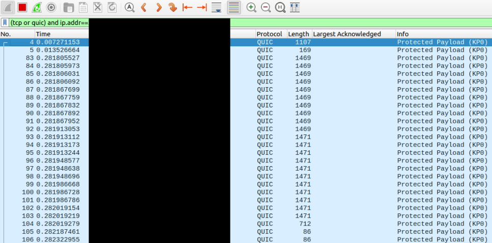

+++
title = "Compiling nginx with http3"
date = 2024-09-10
authors = ["hyouteki"]
description = "This blog provides a step-by-step guide to compiling Nginx with HTTP/3 (QUIC) support. It covers installing OpenSSL 3.x, building Nginx from source, and configuring it to enable HTTP/3. The guide also includes instructions for setting up SSL certificates, modifying Nginx’s configuration for QUIC, and verifying HTTP/3 functionality using Wireshark. This tutorial is designed for those looking to enhance their web server’s performance and security with the latest protocols."
[taxonomies]
tags = ["nginx", "http3", "webserver", "blog"]
+++

This blog provides a step-by-step guide to compiling Nginx with HTTP/3 (QUIC) support. It covers installing OpenSSL 3.x, building Nginx from source, and configuring it to enable HTTP/3. The guide also includes instructions for setting up SSL certificates, modifying Nginx’s configuration for QUIC, and verifying HTTP/3 functionality using Wireshark. This tutorial is designed for those looking to enhance their web server’s performance and security with the latest protocols.

## Install OpenSSL 3.x or Later
Nginx 1.26.2 comes bundled with OpenSSL 1.1.1f by default, which lacks QUIC support. Nginx’s QUIC support begins with OpenSSL 3.0. \
Download and extract OpenSSL 3.0.8, then proceed to build and install it.
```bash
wget https://www.openssl.org/source/openssl-3.0.8.tar.gz
tar -xzf openssl-3.0.8.tar.gz
cd openssl-3.0.8
./config
make
sudo make install
cd ..
```

## Build Nginx 1.26.x with OpenSSL 3.x
After downloading the Nginx source code, extract the contents and prepare for configuration.
```bash
wget http://nginx.org/download/nginx-1.26.2.tar.gz
tar -xzf nginx-1.26.2.tar.gz
cd nginx-1.26.2
```
Rebuild Nginx using OpenSSL 3.x by specifying the appropriate configuration flags.
```bash
./configure \
    --prefix=/etc/nginx --sbin-path=/usr/sbin/nginx \
    --modules-path=/usr/lib/nginx/modules \
    --conf-path=/etc/nginx/nginx.conf \
    --error-log-path=/var/log/nginx/error.log \
    --http-log-path=/var/log/nginx/access.log \
    --pid-path=/var/run/nginx.pid \
    --lock-path=/var/run/nginx.lock \
    --http-client-body-temp-path=/var/cache/nginx/client_temp \
    --http-proxy-temp-path=/var/cache/nginx/proxy_temp \
    --http-fastcgi-temp-path=/var/cache/nginx/fastcgi_temp \
    --http-uwsgi-temp-path=/var/cache/nginx/uwsgi_temp \
    --http-scgi-temp-path=/var/cache/nginx/scgi_temp \
    --with-http_ssl_module --with-http_v2_module \
    --with-http_v3_module --with-openssl=../openssl-3.0.8
make
sudo make install
```
Verify the Nginx build configuration with `nginx -V`.
```bash
nginx version: nginx/1.26.2
built by gcc 9.4.0 (Ubuntu 9.4.0-1ubuntu1~20.04.2)
built with OpenSSL 3.0.8 7 Feb 2023
TLS SNI support enabled
configure arguments: \
    --prefix=/etc/nginx --sbin-path=/usr/sbin/nginx \
    --modules-path=/usr/lib/nginx/modules \
    --conf-path=/etc/nginx/nginx.conf \
    --error-log-path=/var/log/nginx/error.log \
    --http-log-path=/var/log/nginx/access.log \
    --pid-path=/var/run/nginx.pid \
    --lock-path=/var/run/nginx.lock \
    --http-client-body-temp-path=/var/cache/nginx/client_temp \
    --http-proxy-temp-path=/var/cache/nginx/proxy_temp \
    --http-fastcgi-temp-path=/var/cache/nginx/fastcgi_temp \
    --http-uwsgi-temp-path=/var/cache/nginx/uwsgi_temp \
    --http-scgi-temp-path=/var/cache/nginx/scgi_temp \
    --with-http_ssl_module --with-http_v2_module \
    --with-http_v3_module --with-openssl=../openssl-3.0.8
```

## Edit nginx configuration
Modify the Nginx configuration file to enable HTTP/3 and set up the server's SSL certificates. The configuration file is located at `/etc/nginx/nginx.conf`. 
- Adjust the server block to listen on port 443 for both QUIC and SSL connections.
- Specify the root directory and set up file paths for serving content, enabling auto-indexing.
- Add the HTTP/3 Alt-Svc header to enable QUIC connections.
```conf
events {
    worker_connections  1024;
}

http {
    server {
        listen 443 quic reuseport;
        listen 443 ssl;

        ssl_certificate       <ADD_YOUR_CRT>;
        ssl_certificate_key   <ADD_YOUR_KEY>;
        ssl_protocols TLSv1 TLSv1.1 TLSv1.2 TLSv1.3;

        root                  <ADD_YOUR_ROOT>;
        index index.html index.htm;

        location / {
                root          <ADD_YOUR_ROOT>;
                autoindex on;
                try_files $uri $uri/ =404;
        }

        add_header alt-svc 'h3=":443"; ma=86400';
    }
}
```
Save the changes, test the configuration, and start Nginx.
```bash
nginx -t
sudo systemctl start nginx
```
Verify HTTP/3 and QUIC functionality using Wireshark to capture and analyze network traffic, ensuring that the connection traces indicate QUIC support.

> The IPs are masked for obvious reasons. But we can see traces of QUIC connection, which means http3 is working.