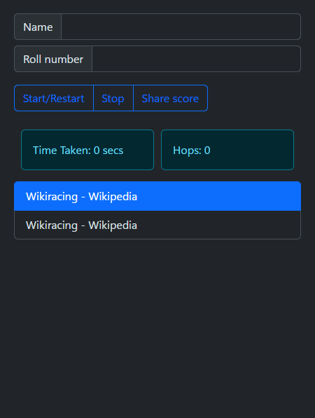

+++
title = "Wikiracing - Chromium Extension"
date = 2024-02-14
authors = ["hyouteki"]
description = "A chromium extension for facilitating wikiracing among participants."
[taxonomies]
tags = ["js", "extention", "chrome", "game", "dev"]
[extra] 
archive = "This project is archived on Feb 21, 2024."
+++

A chromium extension for facilitating [wikiracing](https://en.wikipedia.org/wiki/Wikiracing) among participants.

## Installation
- Download and extract [ZIP](https://github.com/hyouteki/wikiracing/archive/refs/heads/main.zip).
- Navigate to extensions on your chromium browser.
- Enable `developer mode`.
    
- Click `load-unpacked`.
    
- Enable wiki racing extension.
    
- Pin the extension for ease of use.

 
<a class="inline-button" href="https://github.com/hyouteki/wikiracing" style="margin: 10px;">Repository</a>
<a class="inline-button" href="https://github.com/hyouteki/wikiracing/archive/refs/heads/main.zip" style="margin: 10px;">Download ZIP</a>